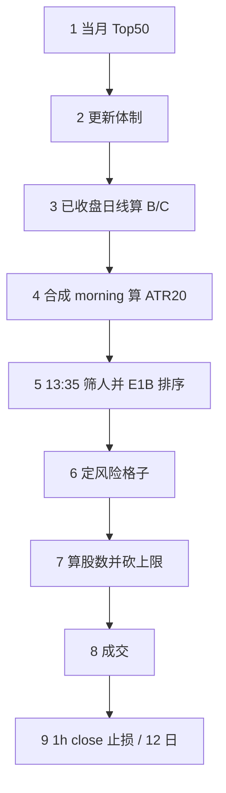

# 一天怎么走完 N1

按这个顺序做。公式和钉死细节在 [Strategy_N1_规格_20260814.md](./Strategy_N1_规格_20260814.md)。取值以 [config/n1.resolved.toml](./config/n1.resolved.toml) 为准，不要三份运行时 toml 一起用。

不是实盘授权。不要改云电脑上正在跑的 N1。

## 数据

1. **当月宇宙**：PIT `stage_250` JSON。可交易 = `rejection_reason is None` 且 `common_stock`。隔离复现用 `isolated-2024-2025/evidence/selection_2024_2025/monthly_universe/stage_250/`。
2. **日线**：宇宙股票 + SPY.US + QQQ.US + 11 个行业 ETF。NY 日历，已收盘。复现窗 2024-01-03..2025-12-31，**2026 不能读**。
3. **1h**：美东 09:30 / 10:30 / 11:30 / 12:30 合成 morning；全天 1h 的 **close** 用来打止损（不看 low）。
4. **15m**：隔离回测成交用。13:35 之后、16:00 之前第一根是 **13:45**，取其 open。
5. **行业**：隔离复现读 `config/sector_by_symbol.csv`（105 只）。`candidate_c.toml` 只有行业名→ETF。2025-06 Top50 的 `FI.US` 不在表里，按规格当天不能新开，不是漏表。
6. **财报**：快照里的 `earnings_events`（`known_at` 不晚于决策时刻）。复现不要拉实盘日历。
7. **体制 19 只日线**：AAPL MSFT NVDA AVGO META GOOGL AMZN TSLA JPM BAC LLY UNH COST WMT HD CAT GE XOM CVX，各至少 100 根；SPY / QQQ 各至少 200 根。

这 19 只**不是买名单，是仓位油门**。换月 Top50、因子、排序、止损都跟它们无关。

## 一个交易日（美东）

半日市：不算 morning、不开新仓。

1. **取当月 Top50。** 有效日 ≤ 今天。不在名单里的不能新开。
2. **更新体制。**
   - 19 只：`close > SMA100` 的比例 = `regime_breadth`
   - SPY、QQQ：`close > SMA200`
   - 三票：SPY 上 + QQQ 上 + (`regime_breadth ≥ 0.50`)。3 = 观察 bull，0 = bear，否则 neutral。缺任何一只当天不改体制。
   - 连续 2 个交易日观察相同，才改 `active`。初始 `active = neutral`，第一天不会变成 bull。
3. **用已收盘日线算因子**（只对 Top50 + 行业 ETF + SPY）。
   - B 层：`candidate_b_score`、`relative_sector_score`、`eligible`（r44>0 且 r88>0 且 ADV≥1 亿）
   - C 层：`candidate_c_score`、`score_percentile`
   - B 层横截面用 pandas `rank(pct=True)`；C 层用确定性排序分位。两套不要混。
4. **合成 morning，算 Wilder ATR20。** 四根小时线 → 一根 13:30 bar。缺 ATR 不能开。
5. **13:35 筛开仓名单。**
   - eligible 且非 ETF 且在 Top50
   - 按 `candidate_c_score` 取 Top 55%
   - 去掉：财报日、当天已平、已持仓、强制平仓
   - 剩下的按 E1B 排：行业相对强度 → C 分位 → 代码
   - 最多 5 个新开；D3 扩展条件满足可到第 6（C 分位≥0.80 且趋势效率分位≥0.60 且加速分位≥0.65）
6. **定风险格子。**
   - `active` 先定 bull / neutral / bear 的风险和上限
   - Strong Bull 还要：`active = bull` **且** 当月宇宙 C 广度≥65% **且** SPY44>0 **且** QQQ44>0
   - C 广度看的是月度池，不是那 19 只
   - N1 只改 Strong Bull 单笔风险为 **0.85%**
7. **算股数（向下取整）：**

   `qty = floor(NAV × trade_risk × size_mult / (stop_atr_mult × ATR20))`

   - `size_mult`：C 分位≥0.80 → 1.15；≥0.50 → 1.00；否则 0.85
   - `stop_atr_mult`（**只用于算股数**）：默认 2；若横截面 ATR% 分位≥0.70 且趋势效率分位≥0.50 且 C 分位≥0.80 → 2.5
   - 再砍到：单票 15% NAV、行业 30%、发行人 15%、体制多头上限

   真正挂在仓上的止损位是另一套：初始 `2.5 × 入场 ATR`，跟踪 `3.0 × 入场 ATR`（`max_r ≥ 1` 才跟）。不要用 2.0/2.5 去比价。
8. **成交。**
   - 隔离回测：15m，正常日第一根是 **13:45** 的 open × (1±10bp)，佣金 1bp。没有 13:45 就不成交。不要用 1h 的 14:30。
   - 纸交易：长桥 Demo 限价 10bp，以券商成交为准。
9. **离场。** 每根已完成 1h 的 **close** 对 `active_stop`（不看 low）。打中就平，当天不能再开这只。没打中才用该小时 high 更新峰值。或持有满 12 个交易日。

## 怎么验收

隔离窗 2024-01-03..2025-12-31，2026 不打开，成本 1bp+10bp：

| | N1 | E2 |
| --- | ---: | ---: |
| CAGR | 21.82% | 21.10% |
| MaxDD | 7.71% | 7.67% |
| 2024 | +27.48% | +23.91% |
| 2025 | +16.14% | +18.09% |

对不上先查：体制是否从 neutral 起、19 只是否写死、两套广度有没有混、B/C 分位函数有没有用反、morning 是否用四根 1h、成交是否 **15m 的 13:45 open**、止损是否看 **1h close**、行业是否用 `sector_by_symbol.csv`、有没有误用 `strategy.toml` 的 20%/40%、有没有用算股数的 2.0× 去打止损。

## 纸交易和回测不要对账的地方

| | 隔离回测 | 纸交易 |
| --- | --- | --- |
| 成交 | 15m 13:45 open + 10bp | 长桥 Demo 限价 10bp，看回执 |
| 行业 | `config/sector_by_symbol.csv` | 当月 bootstrap 行内 `sector` / `reference_etf` |
| 财报 | 快照自带，不读 updates | 另读 `var/paper/strategy_e2/earnings_updates/` |

本仓库没有 token、`state.db`、持仓。
